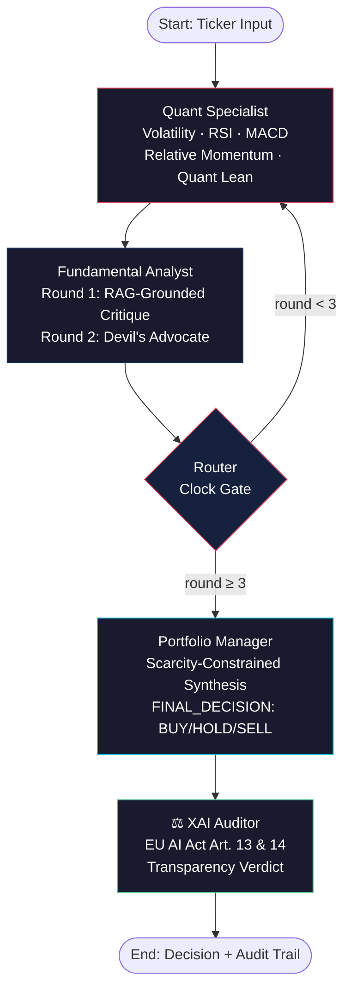
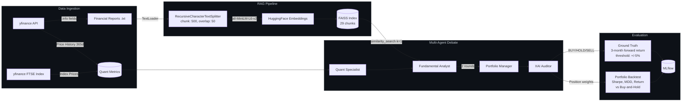
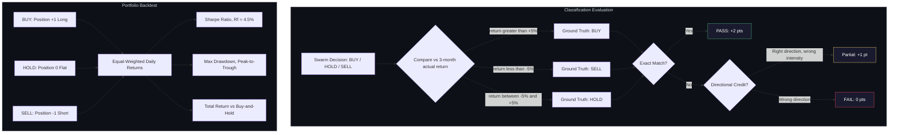

# Alpha-Agents FTSE 100: Multi-Agent LLM Portfolio Management

**MSc Artificial Intelligence Dissertation Heriot-Watt University, Edinburgh (2026)**

**Author:** Pragyansh Vardhan
**Supervisor:** Rob Stewart

---

## Research Question

> *Can a smaller 8B-parameter Llama model match or exceed a 70B-parameter model's financial decision quality when embedded in a well-constrained multi-agent debate architecture?*

## What This Is

A multi-agent LLM system that generates **BUY / HOLD / SELL** investment decisions for FTSE 100 equities. The system extends the AlphaAgents framework (Wang et al., 2025) from the S&P 500 to the UK market, with EU AI Act compliance (Article 13 Transparency, Article 14 Human Oversight) built into the architecture via an explainable audit layer.

The core contribution is empirical: a controlled 5-experiment matrix demonstrating that **model scale does not determine decision quality** a well-constrained 8B model consistently outperformed a 70B model on both classification accuracy and risk-adjusted portfolio return (Sharpe Ratio).

## The Problem

Single-agent LLM systems in financial contexts suffer from two structural failures:

1. **Hallucination without accountability**  a single model can fabricate financial reasoning with no internal challenge mechanism, producing decisions that are unauditable under the EU AI Act and FCA operational resilience standards.
2. **The "bigger is better" assumption**  practitioners default to the largest available model, assuming more parameters produce better financial judgment. This assumption is untested for constrained decision tasks with structured inputs.

## Architecture

Four specialised agents communicate via a **LangGraph stateful DAG** using a Round Robin debate protocol with a clock-gated router:



### Data Pipeline



### Evaluation Protocol



### Agent Roles

| Agent | Role | Key Capability |
|---|---|---|
| **Quantitative Specialist** | Computes risk metrics and momentum signals from 1-year price history | Volatility, Max Drawdown, RSI (14-day), MACD Histogram, Relative Momentum vs FTSE 100, with pre-digested directional lean (BULLISH/BEARISH/MIXED) |
| **Fundamental Analyst** | Critiques quant metrics using RAG-grounded corporate intelligence; Round 2 switches to adversarial "Devil's Advocate" stance | FAISS vector retrieval over enriched financial profiles (valuation, margins, analyst consensus, earnings growth) |
| **Portfolio Manager** | Synthesises the multi-round debate into a final BUY/HOLD/SELL decision under a scarcity constraint | Forced to address the Devil's Advocate's strongest objection before deciding |
| **XAI Auditor** | Documents how the conclusion was reached for EU AI Act Article 13/14 compliance | Produces a PASS/FAIL transparency verdict with compliance notes |

### Key Architectural Features

- **Adversarial Debate Protocol:** Round 1 presents the standard fundamental thesis; Round 2 explicitly challenges it via a Devil's Advocate prompt, forcing the Portfolio Manager to adjudicate between genuinely opposing arguments rather than rubber-stamping a single perspective.
- **Clock-Gated Router:** The `debate_round` counter (owned solely by the Analyst node) prevents infinite loops while ensuring exactly 2 full debate cycles per ticker before routing to the Portfolio Manager.
- **Momentum-Enriched Quant Layer:** RSI, MACD, and FTSE-relative momentum signals are computed deterministically in Python and translated into plain-language interpretations (e.g., "OVERBOUGHT (bearish)") before entering the LLM context  removing a reasoning step the smaller model would otherwise fumble.
- **Single Source of Truth:** Model name and temperature are set once in `run_experiment.py` and propagated via environment variables to all agent files  eliminating config-drift bugs across the multi-file architecture.

## Tech Stack

| Layer | Technology |
|---|---|
| **Orchestration** | LangGraph (stateful DAG), LangChain |
| **LLM Inference** | Groq (free tier): `llama-3.3-70b-versatile`, `llama-3.1-8b-instant` |
| **RAG Pipeline** | LangChain `DirectoryLoader` → `RecursiveCharacterTextSplitter` (500 chars, 50 overlap) → HuggingFace `all-MiniLM-L6-v2` embeddings → FAISS vector store |
| **Data Sources** | yfinance (price history + financial metrics), `ta` library (RSI, MACD) |
| **Evaluation** | Custom ground-truth evaluator (3-month forward returns, ±5% threshold), portfolio backtester (Sharpe Ratio, Max Drawdown, Total Return vs equal-weighted buy-and-hold) |
| **Experiment Tracking** | MLflow |
| **Language** | Python 3.9 |

## Experiment Design

A 5-experiment matrix varying **model scale** (8B vs 70B) and **sampling temperature** (0.0, 0.2, 0.5) across 5 FTSE 100 tickers selected for ground-truth label balance (3 BUY, 1 SELL, 1 HOLD):

| Run | Model | Temp (T) | Research Goal |
|---|---|---|---|
| 1 | `llama-3.3-70b-versatile` | 0.2 | **Gold Standard Baseline**  peak 70B performance under controlled conditions |
| 2 | `llama-3.3-70b-versatile` | 0.0 | **Deterministic Trap**  does greedy decoding cause brittleness? |
| 3 | `llama-3.3-70b-versatile` | 0.5 | **Creative Threshold**  does increased variance promote insight or noise? |
| 4 | `llama-3.1-8b-instant` | 0.2 | **Efficiency Baseline**  can 8B match 70B accuracy? |
| 5 | `llama-3.1-8b-instant` | 0.0 | **Minimalist Logic Test**  8B capability for pure logical processing |

### Evaluation Tickers

| Ticker | Company | Sector | Ground Truth (3-month) |
|---|---|---|---|
| RR.L | Rolls-Royce Holdings | Industrials | BUY (+27-31%) |
| TSCO.L | Tesco | Consumer Defensive | HOLD (−2 to −4%) |
| AAL.L | Anglo American | Basic Materials | BUY (+10-15%) |
| BA.L | BAE Systems | Industrials / Defence | SELL (−10 to −17%) |
| IHG.L | InterContinental Hotels | Consumer Cyclical | BUY (+16-28%) |

## Key Results

### Classification Accuracy

| Run | Model | Temp | Accuracy |
|---|---|---|---|
| 1 | 70B | 0.2 | 40% |
| 2 | 70B | 0.0 | 20% |
| 3 | 70B | 0.5 | 20% |
| **4** | **8B** | **0.2** | **60%** |
| **5** | **8B** | **0.0** | **60%** |

### Risk-Adjusted Portfolio Performance (Sharpe Ratio)

| Run | Model | Temp | Sharpe | Total Return | Max Drawdown |
|---|---|---|---|---|---|
| 1 | 70B | 0.2 | 0.834 | +2.85% | −4.39% |
| 2 | 70B | 0.0 | −2.507 | −5.27% | −7.74% |
| 3 | 70B | 0.5 | −1.481 | −0.84% | −2.72% |
| **4** | **8B** | **0.2** | **2.642** | **+10.77%** | **−4.08%** |
| **5** | **8B** | **0.0** | **2.485** | **+10.55%** | **−4.96%** |
|  | Benchmark |  | ~1.57 | ~10.0% | ~−7.48% |

### Key Findings

1. **Model scale inversely correlated with decision quality.** The 8B model outperformed the 70B on both accuracy (60% vs 27% average) and Sharpe Ratio (2.56 avg vs −1.05 avg) across all temperature conditions. Larger parameter count amplified both signal and noise; for this constrained classification task, noise amplification dominated.

2. **Temperature sensitivity is model-scale-dependent.** The 8B model was temperature-robust (Sharpe range: 0.16 points). The 70B model was temperature-fragile (Sharpe range: 3.34 points), swinging from mildly positive to catastrophically negative across the temperature sweep.

3. **The 70B model exhibited three distinct, temperature-specific failure modes:** confidently-wrong directional inversion at T=0.0, cautious-but-wrong positioning at T=0.2, and near-total decision paralysis at T=0.5. No temperature setting rescued the 70B model, suggesting the problem is structural, not tunable.

4. **Risk-adjusted return (Sharpe) reveals what accuracy hides.** A naive all-BUY strategy achieved 60% accuracy on this ticker set but produced zero alpha over the buy-and-hold benchmark. The fixed pipeline's selective capital allocation achieved the same 60% accuracy while generating genuine risk-adjusted alpha (Sharpe 2.64 vs benchmark 1.57)  a distinction only visible through the portfolio backtest.

## Project Structure

alpha-agents-ftse100/
├── src/
│   ├── agents/
│   │   ├── analyst.py          # Fundamental Analyst (Round 1: critique, Round 2: Devil's Advocate)
│   │   ├── quant.py            # Quantitative Specialist (volatility, RSI, MACD, momentum)
│   │   ├── manager.py          # Portfolio Manager (scarcity-constrained synthesis)
│   │   └── auditor.py          # XAI Auditor (EU AI Act compliance documentation)
│   └── state.py                # LangGraph shared state (AgentState TypedDict)
├── graph.py                    # LangGraph DAG definition + clock-gated router
├── run_experiment.py           # Experiment orchestrator (MLflow + env-var config)
├── run_swarm.py                # Batch pipeline (ticker loop + rate-limit pacing)
├── ground_truth.py             # Evaluation engine (accuracy + directional accuracy)
├── backtest.py                 # Portfolio backtester (Sharpe, MDD, vs buy-and-hold)
├── fetch_all_rag_docs.py       # RAG document fetcher (enriched yfinance profiles)
├── build_vector_db.py          # FAISS index builder
├── financial_reports/          # Enriched financial profiles (.txt, 5 tickers)
├── results/                    # Per-experiment JSON transcripts + backtest metrics
├── evaluation_data.csv         # Ticker list (5 FTSE 100 equities)
├── notebooks/                  # Exploratory data analysis
└── mlruns/                     # MLflow experiment tracking

## Quick Start

### Prerequisites

```bash
pip install langchain langchain-groq langchain-openai langchain-huggingface
pip install langchain-community faiss-cpu
pip install yfinance pandas numpy ta
pip install mlflow python-dotenv
```

### Setup

1. Create a `.env` file with your Groq API key:
    GROQ_API_KEY=gsk_xxxxxxxxxxxx
2. 2. Fetch RAG documents and build the vector index:
```bash
   python fetch_all_rag_docs.py
   python build_vector_db.py
```

3. Configure your experiment in `run_experiment.py`:
```python
   MODEL = "llama-3.1-8b-instant"   # or "llama-3.3-70b-versatile"
   TEMP = 0.2
   TICKERS = 5
```

4. Run:
```bash
   python run_experiment.py
```
   This executes the full pipeline: swarm debate → ground-truth evaluation → portfolio backtest → MLflow logging.

## Limitations & Future Work

- **Sample size (N=5 tickers):** Results are illustrative of the evaluation methodology; a production-grade study would require a larger, sector-diversified universe. Scaling to the full FTSE 100 is constrained by Groq's free-tier daily token limits (100K TPD for 70B models).
- **Single-run per experiment (N=1):** Each experimental cell represents a single execution. Multi-run repetition with mean ± standard deviation reporting would strengthen statistical robustness.
- **RAG data quality:** Financial profiles are sourced from Yahoo Finance's public API (`yfinance.info`), which may contain stale or miscalculated fields (notably dividend yield). Enriching RAG documents with structured data from annual reports remains future work.
- **Forward-looking signals gap:** The system reasons over backward-looking quantitative data and static fundamental snapshots. Forward-looking catalysts (M&A activity, regulatory changes, commodity supercycles) are not captured.
- **Evaluation window sensitivity:** A 3-month forward evaluation window was selected to balance fundamental thesis maturation against noise. Sensitivity analysis across 6-month and 12-month horizons is identified as future work.
- **RAGAS faithfulness score:** The dissertation specifies a >0.85 RAGAS faithfulness threshold as a non-functional requirement (NFR1). This metric is not yet implemented in the evaluation pipeline and remains a priority for future work.
- **Backtest assumptions:** No transaction costs, slippage, or liquidity constraints are modelled. Short selling is assumed to be available at zero cost. These simplifications are standard for a first-pass academic backtest but would need addressing for production deployment.

## References

- Wang, Z., et al. (2025). *AlphaAgents: An Alpha Mining Multi-Agent System for Collaborative Stock Analysis.* arXiv.
- EU AI Act, Articles 13 (Transparency) and 14 (Human Oversight).
- FCA Operational Resilience Standards.

## License

This project is part of an MSc dissertation at Heriot-Watt University. Not licensed for commercial use.

